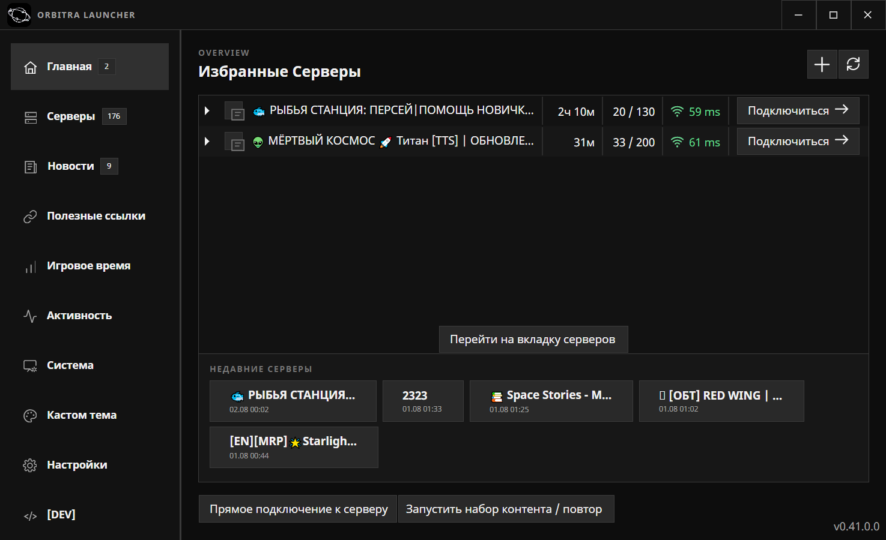
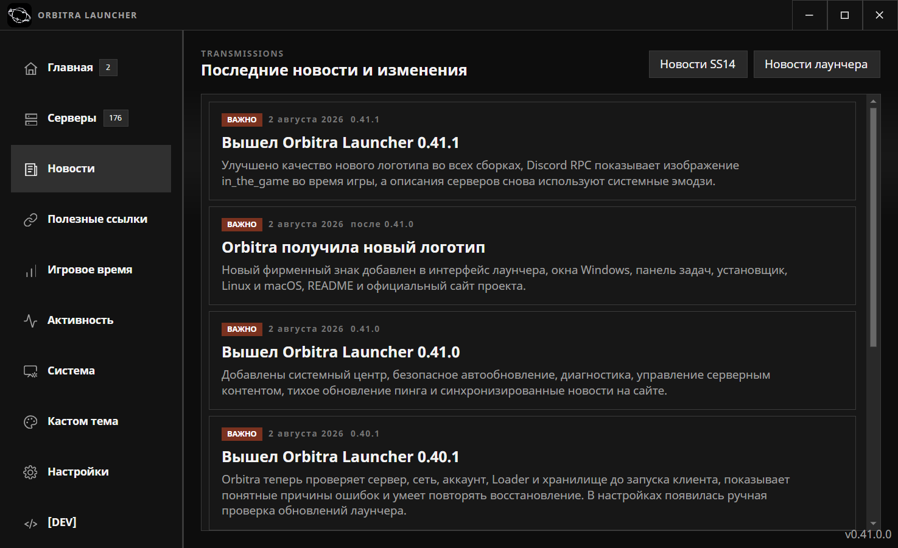
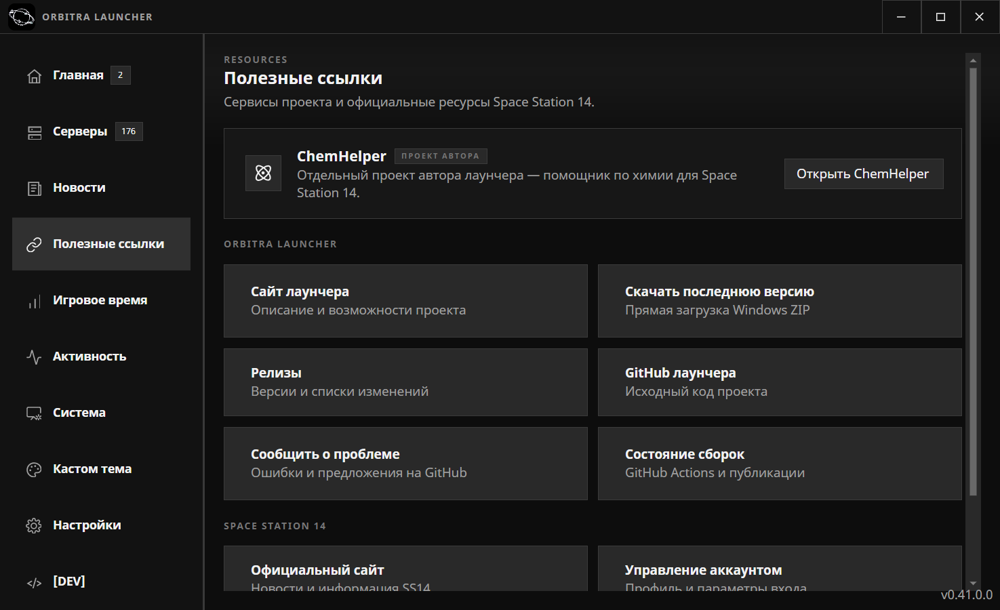
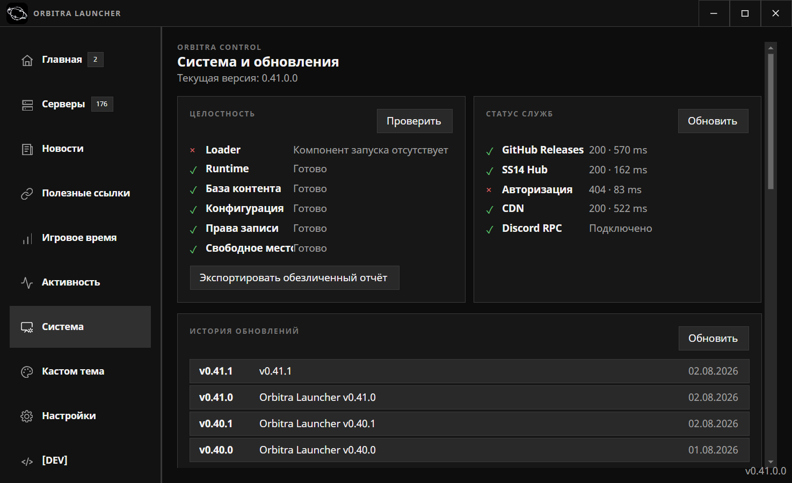

<div align="center">
  

  # ORBITRA LAUNCHER

  **Современный неофициальный лаунчер Space Station 14**<br>
  Серверы, мониторинг, темы, Discord RPC, уведомления и диагностика — в одном интерфейсе.

  [](https://github.com/Endennsss/Orbitra-Launcher/releases/latest)
  [](https://github.com/Endennsss/Orbitra-Launcher/actions/workflows/build-test.yml)
  [](https://github.com/Endennsss/Orbitra-Launcher/releases)
  [](LICENSE.txt)

  [Скачать](https://github.com/Endennsss/Orbitra-Launcher/releases/latest) ·
  [Сайт](https://endennsss.github.io/Orbitra-Launcher/) ·
  [Новости](https://endennsss.github.io/Orbitra-Launcher/#news) ·
  [Сообщить о проблеме](https://github.com/Endennsss/Orbitra-Launcher/issues)
</div>

> [!NOTE]
> Актуальная версия: **0.45.0**. Обновлены профили и мастерская, исправлены интерфейс, отчёты, навигация, серверный список и локальная библиотека тем.

> [!IMPORTANT]
> Orbitra Launcher — независимый неофициальный проект. Он не связан со Space Wizards Federation и не является официальным продуктом Space Station 14.

## Обзор

Orbitra Launcher развивает оригинальный SS14 Launcher, сохраняя совместимость с инфраструктурой Space Station 14. Проект предлагает чёрно-серый интерфейс на Avalonia, тихое обновление данных серверов, персонализацию, системный трей и инструменты диагностики.



## Что умеет Orbitra

### Серверы и подключение

- полный список серверов SS14 с поиском и фильтрацией;
- избранные и недавно посещённые серверы;
- пинг, онлайн, карта, игровой режим и продолжительность раунда;
- цветной индикатор качества соединения с неактивными серыми делениями;
- тихое фоновое обновление показателей без перезагрузки страницы;
- плавное изменение чисел и краткая подсветка направления изменения;
- раскрываемая карточка сервера с анимацией;
- контекстное меню: подключиться, избранное, копирование адреса и сайт;
- горячие клавиши: `Ctrl+K`, `F5`, `Enter`, `Esc`;
- состояния запуска: проверка сервера → загрузка файлов → запуск клиента → подключено;
- прогресс загрузки непосредственно внутри кнопки подключения;
- кэширование изображений и управление загруженным серверным контентом.

### Избранное, трей и уведомления

- выбор конкретных избранных серверов для фонового наблюдения;
- уведомления о возвращении сервера в онлайн, свободном месте и новом раунде;
- уведомления автоматически подавляются во время игры;
- быстрые действия: открыть сервер, подключиться или отключить уведомления;
- сворачивание лаунчера в системный трей вместо закрытия;
- запуск избранного сервера и смена активного аккаунта из трея;
- полное отключение фоновых проверок и уведомлений в настройках.

### Статистика и активность

- учёт личного игрового времени отдельно по каждому серверу;
- общий итог, последняя сессия и дата последнего запуска;
- мини-графики динамики серверных показателей;
- журнал подключений, уведомлений и важных событий;
- единый центр активности для истории работы лаунчера.

### Профиль и друзья

- профиль Orbitra с аватаром, баннером, коротким описанием и любимым сервером;
- точная обрезка, масштабирование и позиционирование аватара и баннера;
- отдельные фирменные окна редактирования и просмотра профиля;
- поиск пользователей и просмотр профилей друзей;
- заявки в друзья и приглашения через `orbitra://connect/...`;
- статусы «В сети», «Играет», «Не беспокоить» и «Невидимый»;
- добровольный показ текущего сервера и быстрый переход к нему;
- статистика игрового времени непосредственно в профиле.

### Интерфейс и персонализация

- тёмная и светлая чёрно-серая темы;
- кастомная тема с выбором цветов через Color Picker;
- собственный статичный фон или анимированный GIF;
- настройка размытия фона и автоматическая проверка контраста;
- предпросмотр темы до применения;
- импорт и экспорт темы вместе с фоном в одном архиве;
- локальная библиотека сохранённых тем;
- выбор общего шрифта лаунчера;
- плавные переходы, фоновые анимации и анимации Lucide-иконок;
- настраиваемый порядок разделов и возможность скрывать пункты навигации;
- системные эмодзи без подмены цифр и обычного текста;
- звуки интерфейса, регулировка громкости и предварительное прослушивание.

### Мастерская тем

- публикация пользовательских тем и установка в одно нажатие;
- карточки с автоматически подготовленным предпросмотром;
- лайки, комментарии, избранное, поиск и сортировка;
- обновление собственных публикаций и управление версиями;
- отметка уже установленной темы;
- предварительная проверка структуры и содержимого архива;

### Новости и полезные ссылки

- оригинальная новостная лента Space Station 14;
- отдельная удалённая лента обновлений Orbitra Launcher;
- счётчик непрочитанных публикаций;
- новости можно обновлять без выпуска новой версии программы;
- встроенные ссылки на сайт, релизы, исходный код, Issues и статус сборок;
- отдельная ссылка на [ChemHelper](https://chemhelper.xo.je/) — другой проект автора Orbitra Launcher.



## Интеграции

| Интеграция | Возможности |
|---|---|
| **Discord Rich Presence** | Сервер, ник, онлайн, пинг, карта и режим; периодическое обновление; изображение `in_the_game` во время игры; отдельные флажки приватности |
| **GitHub Releases** | Проверка версии, безопасная загрузка обновления, проверка SHA-256 и установка после перезапуска |
| **GitHub Pages** | Сайт проекта и общая новостная лента |
| **SS14 Hub** | Список серверов и актуальные сведения о состоянии |
| **SS14 Auth** | Официальная авторизация и управление аккаунтами |
| **SS14 CDN** | Загрузка движка и серверного контента |
| **Windows Tray** | Избранные серверы, аккаунты, уведомления и полный выход |



## Система, обновления и диагностика

Встроенный системный центр проверяет:

- наличие Loader и runtime;
- базу серверного контента и конфигурацию;
- права записи и свободное место;
- GitHub Releases, SS14 Hub, авторизацию и CDN;
- соединение с Discord RPC;
- текущую версию и историю опубликованных релизов.

Отчёт об ошибке экспортируется в обезличенный ZIP: секреты, токены и персональные данные удаляются автоматически.



## Установка

### Готовая сборка Windows

1. Откройте [последний релиз](https://github.com/Endennsss/Orbitra-Launcher/releases/latest).
2. Скачайте `Orbitra_Launcher_Installer.exe` — фирменный установщик на C# и Avalonia.
3. Выберите русский или английский язык и папку установки.
4. После установки нажмите «Запустить и войти»: Orbitra откроет экран авторизации SS14 и первичную настройку.

Для портативного использования скачайте `Orbitra_Launcher_Windows.zip` и распакуйте его вручную.

> [!TIP]
> Установщик всегда получает последний стабильный GitHub Release и проверяет SHA-256 перед распаковкой.

### Системные требования

- Windows 10/11 x64;
- подключение к интернету;
- Discord Desktop — только для Rich Presence;
- права записи в папку установки и локальные данные пользователя.

## Обновление

Orbitra проверяет стабильные GitHub Releases и предлагает обновление внутри интерфейса. Пакет скачивается во временную директорию, сверяется по SHA-256 и применяется после безопасного перезапуска. Автоматическую проверку можно отключить в настройках.

Если встроенное обновление недоступно, установите свежую версию вручную из [Releases](https://github.com/Endennsss/Orbitra-Launcher/releases).

## Настройки приватности

- Discord RPC можно полностью отключить;
- ник, сервер, онлайн, пинг, карту и режим можно скрывать независимо;
- уведомления и фоновое наблюдение за избранными отключаются отдельно;
- диагностический отчёт проходит обезличивание перед упаковкой;
- данные аккаунта хранятся локально и используются для официальной авторизации SS14.

## Сборка из исходников

### Требования

- [.NET 10 SDK](https://dotnet.microsoft.com/download/dotnet/10.0);
- Git с поддержкой submodules;
- Python 3 для создания полного пакета;
- PowerShell 7 рекомендуется для служебных сценариев и сборки установщика.

```powershell
git clone --recursive https://github.com/Endennsss/Orbitra-Launcher.git
cd Orbitra-Launcher
dotnet build SS14.Launcher/SS14.Launcher.csproj -c Release
```

Проверка тестов:

```powershell
dotnet test SS14.Launcher.Tests/SS14.Launcher.Tests.csproj -c Release
```

Полный Windows-пакет:

```powershell
python publish.py windows --x64-only
```

Результат появится в `Orbitra_Launcher_Windows.zip`.

Сборка фирменного C#-установщика одним EXE:

```powershell
.\tools\build-installer.ps1
```

### Изолированный профиль разработки

```powershell
$env:SS14_LAUNCHER_APPDATA_NAME = "launcherTest"
dotnet run --project SS14.Launcher/SS14.Launcher.csproj
```

## Публикация новостей

Лаунчер читает публикации из [`news.json`](news.json) через Raw GitHub, поэтому новость можно добавить без новой сборки:

```powershell
.\tools\publish-news.ps1 `
  -Title "Название обновления" `
  -Text "Краткое описание изменений" `
  -Link "https://github.com/Endennsss/Orbitra-Launcher/releases"
```

GitHub Pages автоматически обновляет новостной раздел сайта после отправки изменений в `main`. При недоступности сети приложение показывает встроенный резервный список.

## Структура репозитория

```text
SS14.Launcher/            Основное приложение Avalonia
SS14.Loader/              Загрузка и запуск игрового клиента
SS14.Launcher.Bootstrap/  Обновление и запуск Orbitra
Orbitra.Installer/        Фирменный сетевой установщик C# / Avalonia
SS14.Launcher.Tests/      Автоматические тесты
docs/                     Сайт и скриншоты проекта
tools/                    Команды обслуживания проекта
news.json                 Удалённая лента новостей
publish.py                Создание релизных пакетов
```

## Технологии

- **C# / .NET 10** — приложение и служебная логика;
- **Avalonia UI 11** — кроссплатформенный интерфейс;
- **SQLite** — локальные данные, история и кэш;
- **DiscordRPC** — Rich Presence;
- **Supabase** — профили, друзья и мастерская сообщества;
- **Lucide** — единый набор интерфейсных иконок;
- **GitHub Actions** — тесты, сайт и релизная сборка.

## Обратная связь

- ошибки и предложения: [GitHub Issues](https://github.com/Endennsss/Orbitra-Launcher/issues);
- состояние автоматических сборок: [GitHub Actions](https://github.com/Endennsss/Orbitra-Launcher/actions);
- история версий: [GitHub Releases](https://github.com/Endennsss/Orbitra-Launcher/releases).

Перед созданием Issue приложите обезличенный отчёт из вкладки **Система** и кратко опишите шаги воспроизведения.

## Лицензия и авторство

Orbitra Launcher основан на [официальном SS14.Launcher](https://github.com/space-wizards/SS14.Launcher) и распространяется по лицензии [MIT](LICENSE.txt).

Space Station 14, связанные названия и материалы принадлежат соответствующим правообладателям. ChemHelper и Orbitra Launcher — отдельные проекты одного автора.

<div align="center">
  <sub>Создано для сообщества Space Station 14.</sub>
</div>
